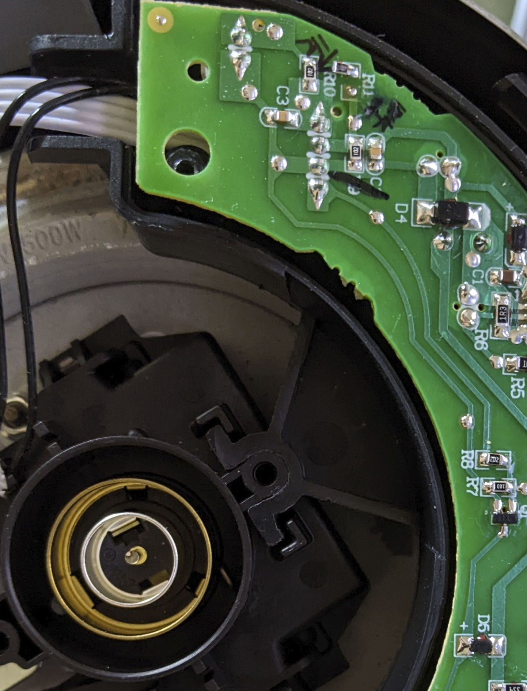
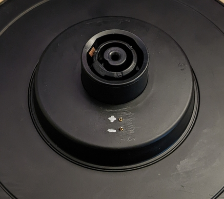
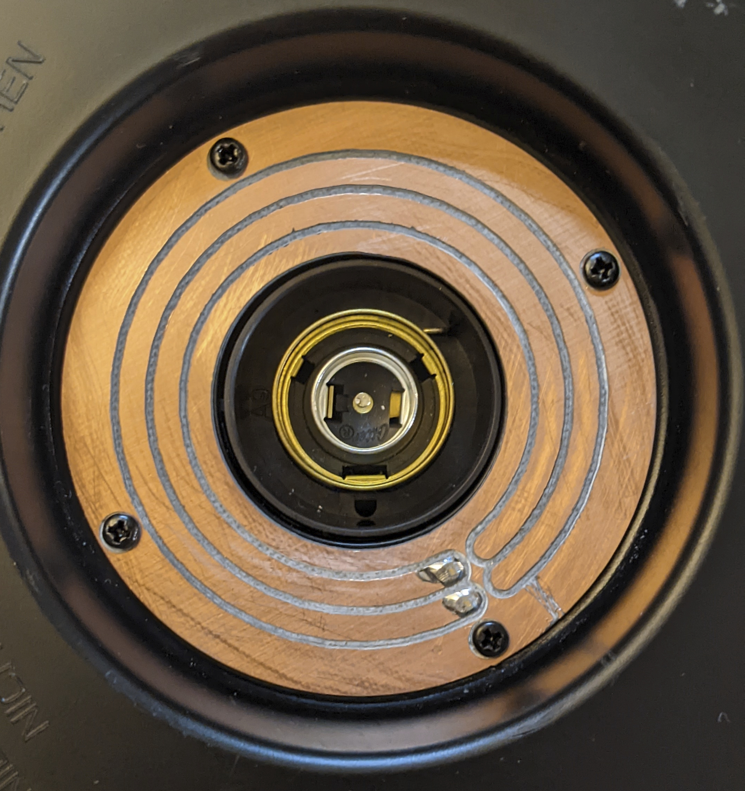

# Hardware
This folder will contain any hardware pertaining to the Project, including formware.

## KettleController
This folder has the hardware needed to build my prototype of the kettle, more specifics to come.
- 3D models (STLs and CAD files)
- Board Designs (KiCad)
- Controller Firmware (Arduino Framework, Initial revision)

For Connections see the [Schematic](./KettleController/Controller_Schematic.pdf).

## To Do
- [x] Publish the Project
- [ ] Migrate firmware to ESP-IDF
- [ ] Eliminate _The Ring of Power_ [Pictured Here](./img/ring_install.jpg).

## Bill Of Materials

| Part   | Use | Qty | Origin |
|--------|-----|-----|--------|
| 1.7L Farberware Electronically controlled Kettle | Vessel | 1 | Purchase|
| ESP32 WEMOS Dev Kit            | Controller | 1 | Purchase |
| 128x32 SSD1306 I2C OLED Module | Display | 1 | Purchase |
| Touch Sensor | Physical User input | 1 | Purchase |
| [Ring of Power](./KettleController/The_Ring_of_Power) | Supplemental power input | 1 | Fabricate |
| 6mmx2mm Pogo Pin | Supplemental Power input | 2 | Purchase |
| [Controller Housing](./KettleController/3D_Models/control_box.stl) | House and Mount components | 1 | Fabricate |
| [Outer Plate](./KettleController/3D_Models/control_box_outer_plate.stl) | Mount Housing | 1 | Fabricate |
| [Inner Plate](./KettleController/3D_Models/control_box_inner_plate.stl) | Fasten Mount | 1 | Fabricate |
| [Wemos Clip](./KettleController/3D_Models/control_box_wemos_clip.stl) | Fasten Wemos to the Housing | 1 | Fabricate |
| M2.6x6mm self-tapping screws | Fastening the ring of power | 4 | Purchase|
| M2.3x8mm self-tapping screws | Fasten the Controller Housing to the Outer Plate | 6 | Purchase |
| M2.3x8mm self-tapping screws | Fasten the Controller Housing Mount to the inner plate | 4 | Purchase |

---
## Hardware Modifications

As mentioned in the Schematic, The board in the base of the kettle needs to be modified, R11 needs to be disconnected from the 5V rail shoewn [here](./img/BoardNormal.jpg) before, and should look like this afterwards:

(it doesn't need to stay on the board, I just did that as a temporary measure)

To install the ring of power, there are 2 pogo-pins that need to be installed in the base, you can 3D print [this drill guide](./KettleController/3D_Models/control_box_drill_template.stl) to position them correctly:

The Ring itself will also need 2 holed drilled to accept power leads, and you can use the same drill template as for the pogo pins, just drill it out larger to fit your wired through. I'd recommend silicone insulated wires for this application, as I don't have a method devised to restrain them from coming into contact with the kettle heater.
The installed ring of power should look like this:

abd is mounted with 4x M2.6x6mm self-tapping screws
